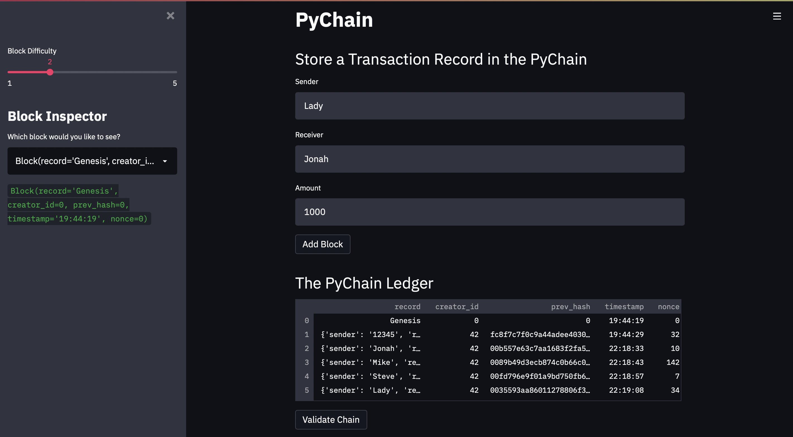

### Blockchain Based Ledger Application 

**Overview of the project and project goals**

I assumed the role of a fintech engineer for a bank, who’s working as the lead developer on the decentralized finance team. The goal was to build a blockchain-based ledger system, complete with a user-friendly web interface. This ledger should allow partner banks to conduct financial transactions (that is, to transfer money between senders and receivers) and to verify the integrity of the data in the ledger. 

## Screenshots of Application

# Blockchain containing multiple blocks


# Blockchain validation 


## Required Dependencies 

```
import streamlit as st
from dataclasses import dataclass
from typing import Any, List
import datetime as datetime
import pandas as pd
import hashlib
```

* [pandas1.2.4](https://pandas.pydata.org) - Open source data analysis and manipulation tool, built on top of the Python programming language.

* [Streamlit](https://streamlit.io) - Open source app framework for Machine Learning and Data Science teams.

* [Dataclasses](https://docs.python.org/3/library/dataclasses.html#module-dataclasses) - A class decorator which inspects a class definition for variables with type annotations.

* [Typing](https://docs.python.org/3/library/typing.html#module-typing) - This tool provides a standard syntax for type annotations.

* [Datetime](https://docs.python.org/3/library/datetime.html) - The datetime module supplies classes for manipulating dates and times.

* [Hashlib](https://docs.python.org/3/library/hashlib.html) - This module implements a common interface to many different secure hash and message digest algorithms.

## Installation

1. Clone repo from GitHub to your computer:

```
git clone https://github.com/JonahLeggett/Blockchain_Ledger.git
```

2. Open **pychain.py** in VS Code.

## Run Streamlit

1. Navigate to the 'Blochain_Ledger' repo folder in terminal.

2. Run the following command in terminal:

```
streamlit run pychain.py
```

## License

MIT

## Contact Information: 


- [LinkedIn](https://www.linkedin.com/in/jonah-l-29278a8a/)
- [GitHub](github.com/JonahLeggett)
- **Jonah.Leggett@gmail.com**
